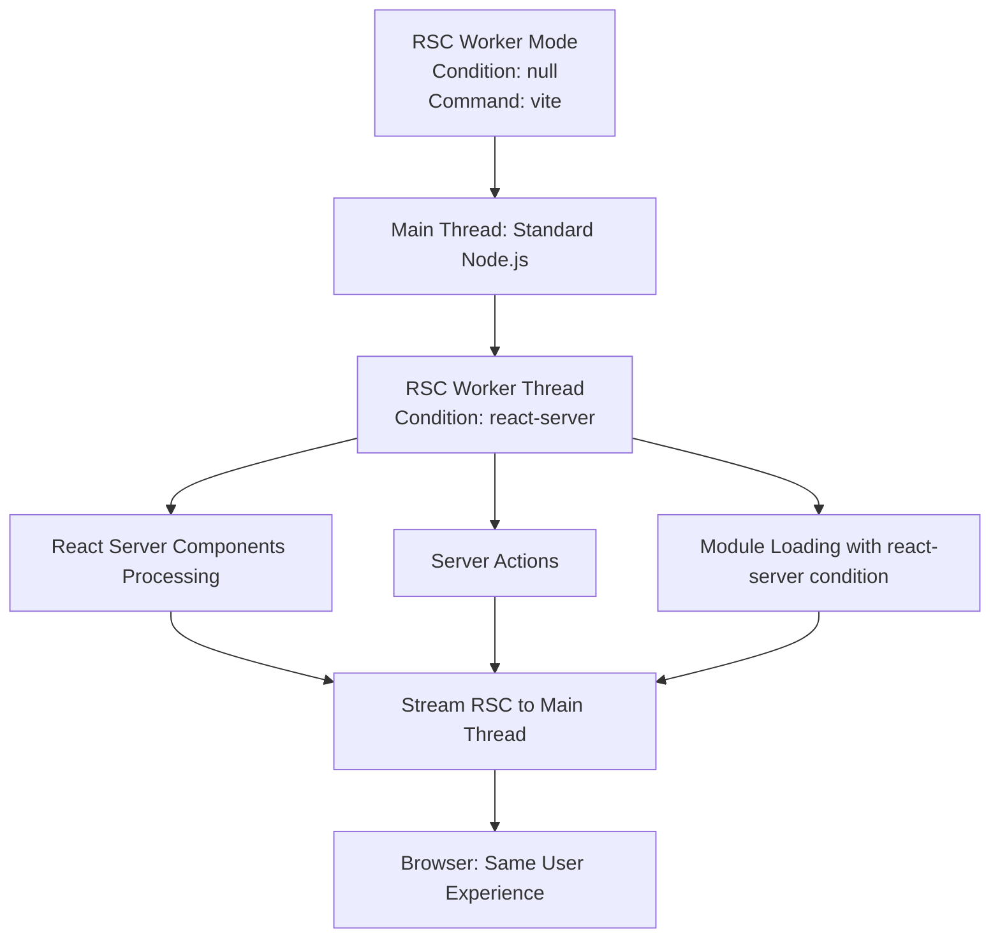

# Core Concepts

This document explains the fundamental concepts and architecture of the Vite React Server Plugin.

## Development Modes & Conditions

The plugin provides two development modes that offer **identical user experiences** but differ in their internal architecture:

### Development Modes

Both modes start your application in the browser and provide the same development experience. The difference is purely internal - how the plugin handles React Server Components processing.

#### **RSC Worker Mode** (Default)
**Condition:** `null` (no special condition)  
**Command:** `vite` or `npm run dev:client`  
**Internal Architecture:** Uses RSC worker thread



**Why use this mode:**
- Default Vite behavior (no special setup)
- Worker thread isolation for RSC processing
- Good for testing client-side behavior

#### **Direct Server Mode** (Optimized)
**Condition:** `react-server`  
**Command:** `NODE_OPTIONS="--conditions react-server" vite` or `npm run dev`  
**Internal Architecture:** Direct main thread processing

```mermaid
graph TD
    A[Direct Server Mode<br/>Condition: react-server<br/>Command: NODE_OPTIONS="--conditions react-server" vite] --> B[Main Thread: RSC Environment]
    B --> C[Direct React Server Components Processing]
    B --> D[Server Actions in Main Thread]
    B --> E[Module Loading with react-server condition]
    C --> F[Stream RSC Directly]
    D --> F
    E --> F
    F --> G[Browser: Same User Experience]
```

**Why use this mode:**
- No worker thread overhead
- Direct RSC processing in main thread
- Better debugging experience for server components
- More efficient for server-side development

### Build Environment (Static Generation)
**Condition:** `react-server` (for final build step)  
**Command:** `npm run build` (runs all three builds)  
**Purpose:** Static site generation

```mermaid
graph TD
    A[Build Environment<br/>Condition: react-server<br/>Command: npm run build] --> B[Static Build<br/>vite build]
    A --> C[Client Build<br/>vite build --ssr]
    A --> D[Server Build<br/>NODE_OPTIONS="--conditions react-server" vite build --ssr]
    
    B --> E[dist/static/]
    C --> F[dist/client/]
    D --> G[dist/server/]
    
    D --> H[HTML Worker<br/>Only during builds]
    H --> I[index.html + index.rsc]
    I --> E
```

**Build Sequence:**
1. **Static Build:** `vite build` → `dist/static/`
2. **Client Build:** `vite build --ssr` → `dist/client/`
3. **Server Build:** `NODE_OPTIONS="--conditions react-server" vite build --ssr` → `dist/server/` + final `dist/static/`

**Note:** The HTML worker is only used during builds, not during development. There's no RSC worker → HTML worker communication in development mode.

## Environment Detection

The plugin uses Node.js conditions to determine execution context:

```typescript
import { getCondition } from "vite-plugin-react-server/config";

const condition = getCondition('')
const dirname = new URL('.', import.meta.url).pathname;
const createRscStream = await import(`${dirname}/createRscStream.${condition}.js`);
const createHandler = await import(`${dirname}/createHandler.${condition}.js`);

export { createRscStream, createHandler };
```

- **`react-server`**: Server-side rendering and React Server Components
- **`react-client`**: Client-side rendering and hydration
- **`null`**: Standard browser environment

## Client-Server Separation

The plugin operates with a clear separation between client and server contexts:

### Execution Modes

```bash
# Server mode - direct React pipeline
NODE_OPTIONS="--conditions react-server" vite

# Client mode - uses worker threads
vite
```

## React Server Components (RSC)

### RSC Stream Processing

The plugin processes RSC streams through a pipeline:

1. **RSC Generation**: Server components generate RSC payload
2. **Stream Transformation**: RSC stream converted to HTML via workers
3. **HTML Output**: Final HTML written to bundle

There's two type of streams the plugin is able to generate:

#### Headless RSC streams

Headless means that it will only include the `Root` component.

During development, it streams headless mode for `text/x-component` requests. Alternatively, you can use the `.rsc` extension for the request.

During a build, the headless streams are written to a file at `${route}/index.rsc`.

#### Full RSC streams

Full means they include the document html structure. `Html` and `Root` component. This full RSC document is sent to the `html-worker` during a build. The worker transforms it to html and streams the result back. The plugin will then write the results to `${route}/index.html`.

```typescript
// RSC worker generates stream
const rscStream = renderToReadableStream(element);

// HTML worker transforms RSC to HTML
const htmlStream = createRscToHtmlStream({
  worker: htmlWorker,
  route: "/page",
  moduleBaseURL: "/",
});

rscStream.pipe(htmlStream);
```

## Plugin Architecture

### Core Components

1. **Main Plugin**: Orchestrates build process and development server
2. **RSC Worker**: Handles server-side React rendering
3. **HTML Worker**: Transforms RSC streams to HTML
4. **Loader System**: Manages module resolution and transformations

### Build Targets

The plugin generates three build outputs:

```
dist/
├── static/     # Browser-ready static files (HTML + RSC)
├── client/     # Server-side rendering modules  
└── server/     # React Server Components modules
```

#### Static Build (`vite build`)
- Generates static HTML files
- Includes RSC payload for hydration
- Optimizes assets for production

#### Client Build (`vite build --ssr`)
- Server-side rendering modules
- Hydration scripts
- Client-side assets

#### Server Build (`NODE_OPTIONS="--conditions react-server" vite build`)
- React Server Components
- Server actions
- Server-only modules

### Configuration Flow

```typescript
// vite.config.ts
import { defineConfig } from "vite";
import { vitePluginReactServer } from "vite-plugin-react-server";
import { Css } from "vite-plugin-react-server/components"

export default defineConfig({
  plugins: vitePluginReactServer({
    moduleBase: "src",
    Page: (url) => `src/pages${url}/page.tsx`,
    props: (url) => `src/pages${url}/props.ts`,
    components: {
      // optional: direct component inputs (react-server only)
      Html: ({ Root, cssFiles, globalCss, pageProps, Page }) => (
        <html>
          <head>
            <Css cssFiles={globalCss} />
          </head>
          <body>
            <Root as="div" id="root" cssFiles={cssFiles} Page={Page} pageProps={pageProps} />
          </body>
        </html>
      ),
    }
    build: { pages: ["/", "/about"] }
  })
});
```

## Module Resolution

### Auto-Discovery Patterns

The plugin uses regex patterns to identify different module types:

```typescript
const AUTO_DISCOVER = {
  modulePattern: /\.(m|c)?(j|t)sx?$/,
  serverPattern: /(?:\.\/)?server(?:\.(m|c)?(j|t)sx?)?$/,
  clientPattern: /(?:\.\/)?client(?:\.(m|c)?(j|t)sx?)?$/,
  pagePattern: /(?:\.\/)?page(?:\.(m|c)?(j|t)sx?)?$/,
  propsPattern: /(?:\.\/)?props(?:\.(m|c)?(j|t)sx?)?$/,
};
```

### Directive Processing

The plugin processes React directives to determine module boundaries with intelligent context-aware validation:

```typescript
// Server directive - can be file-level or function-level
"use server";
export async function serverAction() {
  // Server-only code
}

// Client directive - file-level only
"use client";
export function ClientComponent() {
  // Client-only code
}
```

### Advanced Directive Validation

The plugin provides comprehensive validation with context-aware error messages:

#### Context Detection

```typescript
// ✅ Valid: Top-level function with server directive
export async function validServerAction() {
  "use server";
  return await database.query();
}

// ❌ Invalid: Nested function
export function outer() {
  function inner() { 
    "use server"; // Invalid: nested function
    return 1; 
  }
}

// ❌ Invalid: Class method
export class Calculator {
  async add(a, b) { 
    "use server"; // Invalid: class method
    return a + b; 
  }
}
```

#### Error Detection Categories

The plugin provides specific, actionable error messages for:

- **Nested Functions**: Detects directives in functions inside other functions
- **Class Methods**: Identifies directives in class method definitions  
- **Non-async Server Functions**: Validates that server directives are in async functions
- **Function Type Detection**: Provides context-specific messages for arrow functions, class methods, etc.

#### Configuration Options

```typescript
const DIRECTIVE_CONFIGS = {
  client: {
    functionLevel: false,
    validate: (params) => params.index === 0, // Must be at file start
    warning: "'use client' directive is only allowed at the top of a file"
  },
  server: {
    functionLevel: true,
    validate: (params) => {
      const before = params.code.slice(0, params.index).trim();
      return before === '' || before.endsWith('\n');
    },
    warning: "File-level directives must be at the top of the file"
  }
};

// Error handling configuration
const panicThreshold = 'none' | 'critical_errors' | 'all_errors';
```

## CSS Handling

### CSS Collection

The plugin collects CSS from various sources:

1. **Module CSS**: CSS imported by components
2. **Global CSS**: Application-wide styles
3. **Inline CSS**: Styles embedded in HTML

```typescript
interface CssFile {
  href: string;
  content?: string;
  inline?: boolean;
  media?: string;
  rel?: string;
}
```

### Custom Root as CSS Filter Component

Here's an example from the MMC project, which uses the Root component to filter out some css modules that only include variables.

```typescript
import React from "react";
import { Css } from "vite-plugin-react-server/components";
import type { RootProps } from "vite-plugin-react-server/types";
import { mainTheme, themes } from "./config/themeConfig.js";

const removableCSS = [
  "/src/css/4ymm.module.css",
  "/src/css/5-6ymm.module.css",
  "/src/css/7mmc.module.css",
  "/src/css/8mmc.module.css",
  "/src/css/9mmc.module.css",
];

const createFilter = (theme: Theme) => {
  if (theme === "5ymm" || theme === "6ymm") {
    return [theme, removableCSS.filter((css) => css.includes("5-6ymm"))];
  }
  return [theme, removableCSS.filter((css) => css.includes(theme))];
};

const filters = Object.fromEntries(themes.map(createFilter)) as {
  [key in Theme]: string[];
};

export const MmcRoot = ({
  as: Component,
  cssFiles = new Map<string, never>(),
  pageProps = { pathInfo: { theme: mainTheme } },
  Page,
  ...props
}: RootProps<{
  pathInfo: { theme: Theme };
}>) => {
  const theme = pageProps.pathInfo.theme;
  const cssArray = Array.from(cssFiles.values());
  const removeNonCurrentThemeCss = new Map(
    cssArray
      .filter(
        (file) =>
          !removableCSS.includes(file.id) || filters[theme].includes(file.id)
      )
      .map((file) => [file.id, file])
  );
  return (
    <Component {...props}>
      <Page {...pageProps} />
      <Css cssFiles={removeNonCurrentThemeCss} />
    </Component>
  );
};

```

The Root component will be used during development and static generation.

## Development vs Production

### Development Mode

- Uses worker threads for RSC processing
- Hot module replacement (HMR) support
- Real-time error reporting
- Source map preservation

### Production Mode

- Optimized worker creation
- Minified output
- Asset optimization
- Performance metrics collection

## Error Handling

### Error Boundaries

```typescript
// HTML Worker error handling
const stream = ReactDOMServer.renderToPipeableStream(elements, {
  onError: (error: unknown, errorInfo: ErrorInfo) => {
    sendMessage({
      type: "ERROR",
      id,
      error: error instanceof Error ? error : new Error(String(error)),
      errorInfo: {
        componentStack: errorInfo.componentStack,
        digest: errorInfo.digest,
      },
    });
  },
  onShellError: (error: unknown) => {
    sendMessage({
      type: "SHELL_ERROR",
      id,
      error: error instanceof Error ? error : new Error(String(error)),
    });
  },
});
```

### Error Propagation

Errors are propagated through the message system:

1. Worker catches error
2. Serializes error details
3. Sends error message to main thread
4. Main thread handles error appropriately

## Performance Considerations

### Streaming

The plugin uses streaming for optimal performance:

- RSC streams are processed as they arrive
- HTML is generated incrementally
- CSS is collected and optimized during streaming

### Memory Management

- Workers have configurable memory limits
- Streams are cleaned up after processing
- Render states are garbage collected

### Metrics Collection

```typescript
interface StreamMetrics {
  chunks: number;
  bytes: number;
  duration: number;
  startTime: number;
  endTime?: number;
}
```

The plugin tracks performance metrics throughout the build process to help identify bottlenecks and optimize performance.

<!-- TOC START -->

## 📚 Documentation Navigation

<!-- Auto-generated TOC - Do not edit manually -->

## Table of Contents

<!-- Auto-generated TOC - Do not edit manually -->


1.	[Getting Started](./getting-started.md)
	- [Installation and Setup](./getting-started.md#installation-and-setup)
	- [Basic Configuration](./getting-started.md#basic-configuration)
	- [Example Projects](./getting-started.md#example-projects)
2.	**[Core Concepts](./core-concepts.md) ← you are here**
	- [Client-Server Separation](./core-concepts.md#client-server-separation)
	- [React Server Components](./core-concepts.md#react-server-components)
	- [Plugin Architecture](./core-concepts.md#plugin-architecture)
3.	[Configuration Guide](./configuration.md)
	- [Plugin Options](./configuration.md#plugin-options)
	- [Routing Configuration](./configuration.md#routing-configuration)
	- [Build Configuration](./configuration.md#build-configuration)
4.	[CSS & Styling](./css-handling.md)
	- [CSS Collectors](./css-handling.md#css-collectors)
	- [Inline CSS](./css-handling.md#inline-css)
	- [Custom CSS Processing](./css-handling.md#custom-css-processing)
5.	[Server Actions](./server-actions.md)
	- [Creating Server Actions](./server-actions.md#creating-server-actions)
	- [Client Integration](./server-actions.md#client-integration)
	- [Error Handling](./server-actions.md#error-handling)
	- [Database Integration](./server-actions.md#database-integration)
6.	[Build & Deployment](./build-orchestration.md)
	- [Multiple Build Targets](./build-orchestration.md#multiple-build-targets)
	- [Plugin Architecture](./build-orchestration.md#plugin-architecture)
	- [Environment-Specific Builds](./build-orchestration.md#environment-specific-builds)
7.	[Advanced Development](./advanced-topics.md)
	- [Custom Workers](./advanced-topics.md#custom-workers)
	- [Message System](./advanced-topics.md#message-system)
	- [Extending the Plugin](./advanced-topics.md#extending-the-plugin)
8.	[Plugin Internals](./transformer-plugin.md)
	- [Plugin Architecture](./transformer-plugin.md#plugin-architecture)
	- [Transformation Process](./transformer-plugin.md#transformation-process)
	- [Directive Handling](./transformer-plugin.md#directive-handling)
9.	[Worker System](./rsc-worker.md)
	- [Worker Architecture](./rsc-worker.md#worker-architecture)
	- [Message Handling](./rsc-worker.md#message-handling)
	- [Performance Optimization](./rsc-worker.md#performance-optimization)
10.	[API Reference](./api-reference.md)
	- [Plugin Options](./api-reference.md#plugin-options)
	- [Component Props](./api-reference.md#component-props)
	- [Worker Messages](./api-reference.md#worker-messages)
	- [Type Definitions](./api-reference.md#type-definitions)
11.	[React Compatibility](./react-type-compatibility.md)
	- [Type System Overview](./react-type-compatibility.md#type-system-overview)
	- [Generic Types](./react-type-compatibility.md#generic-types)
	- [Version Compatibility](./react-type-compatibility.md#version-compatibility)
12.	[Troubleshooting](./troubleshooting-guide.md)
	- [Common Issues](./troubleshooting-guide.md#common-issues)
	- [Debugging Tips](./troubleshooting-guide.md#debugging-tips)
	- [Performance Optimization](./troubleshooting-guide.md#performance-optimization)

### Quick Links
- [🏠 Main Documentation](./README.md)
- [🚀 Getting Started](./getting-started.md)
- [📖 GitHub Repository](https://github.com/nicobrinkkemper/vite-plugin-react-server)
- [🎮 Official Demo](https://github.com/nicobrinkkemper/vite-plugin-react-server-demo-official)

---

<!-- TOC END -->


