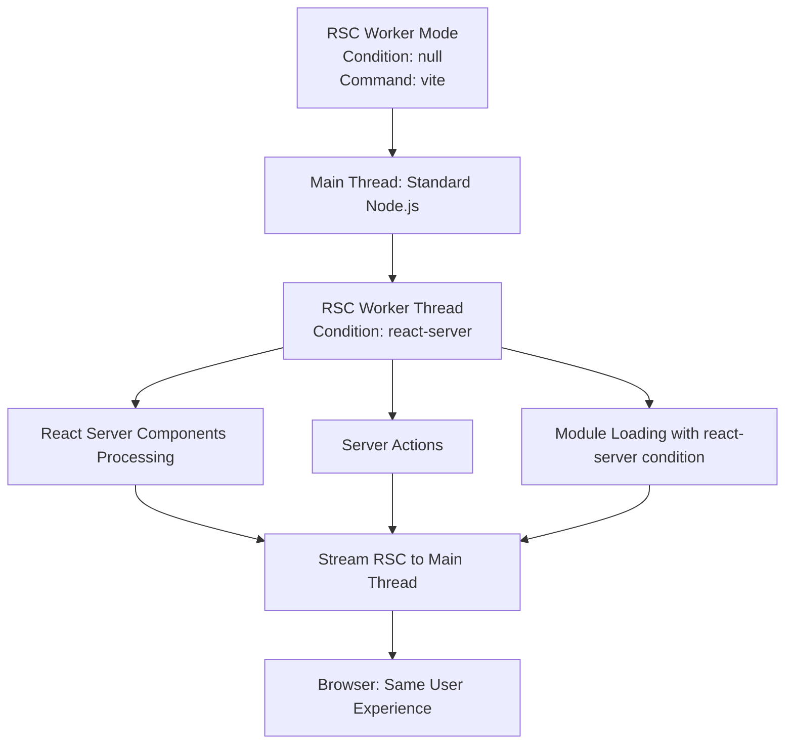
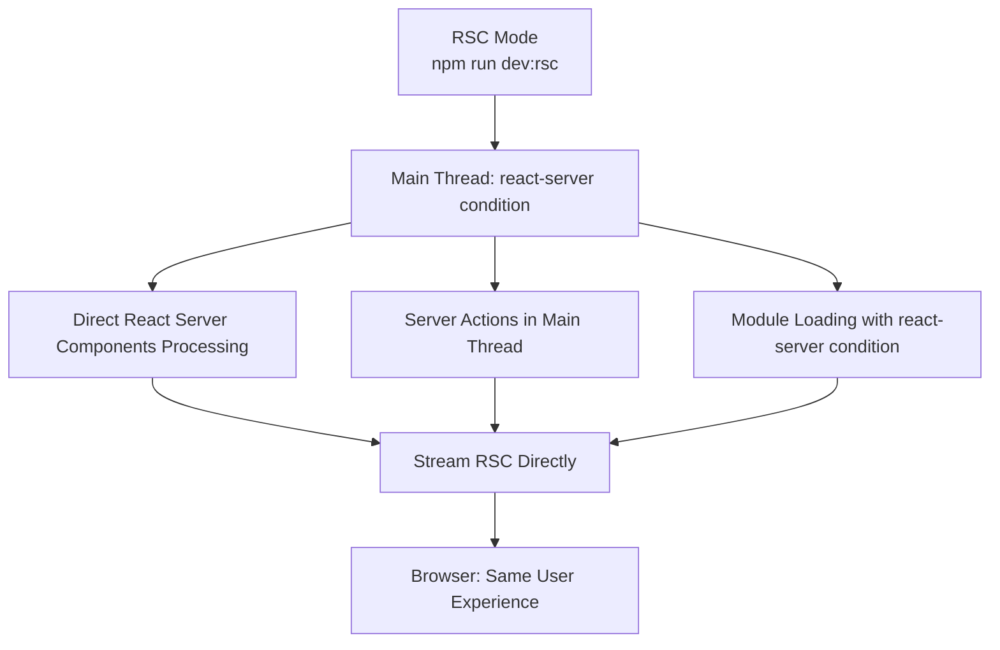
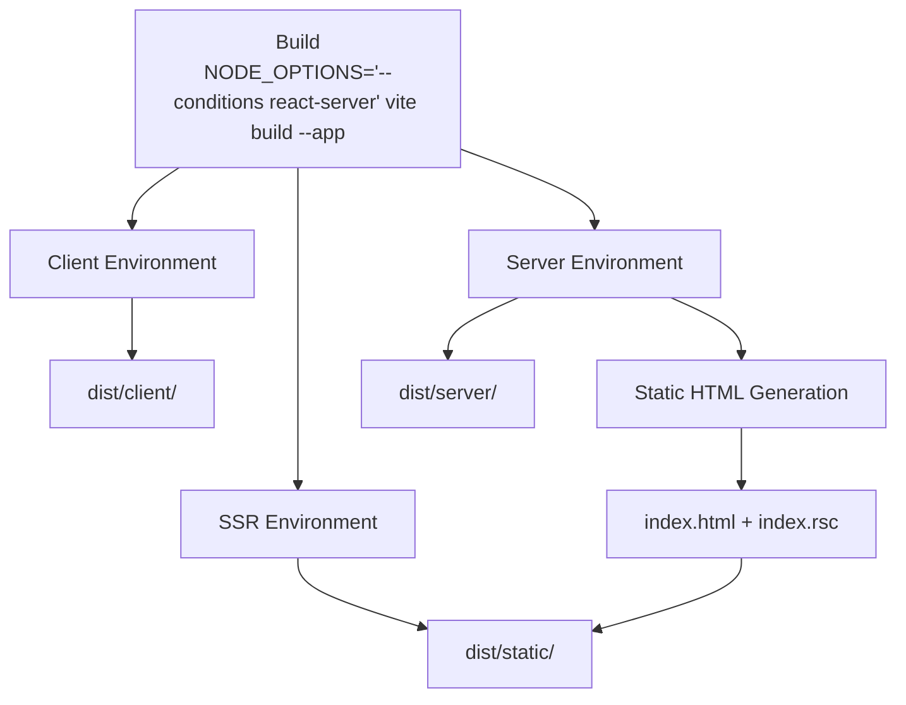

# Core Concepts

This document explains the fundamental concepts and implementation of the Vite React Server Plugin, which uses **React conditions** to provide adaptive execution environments for both React Paradigms: client and server.

## React Conditions

The plugin uses Node.js conditions to dynamically load the appropriate implementation for each execution environment:

- react-server (server for short)
- non-react-server (client for short)

Not all coding projects are the same. For example, our project might just be a server or our project might be a static site without a server. In both those cases we can benefit from React Server Components during development with vite. 

### Condition-Based Module Loading

The plugin automatically detects the execution environment and loads the correct implementation:

```typescript
// Automatic condition detection and module loading
import { getCondition } from './config/getCondition.js';

const condition = getCondition(''); // Returns 'client' or 'server'
const { vitePluginReactServer, vitePluginReactClient } = await import(`./plugin.${condition}.js`);
```

### Execution Environments

| Environment | Condition | Use Case | Implementation |
|-------------|-----------|----------|----------------|
| **Client** | `null` (default) | Browser, client-side builds | Client-specific modules |
| **Server** | `react-server` | Server-side rendering, RSC processing | Server-specific modules |

## Development Modes & Conditions

The plugin provides two development modes that offer **similar user experiences** but differ in their internal implementation:

### dev:rsc (Server First)

```bash
NODE_OPTIONS='--conditions react-server' vite
```

- Main thread has `react-server` condition
- RSC rendering happens **directly on main thread** using Vite's environment runner
- No RSC worker in dev (proper HMR support via Vite's module graph)
- HTML worker optional for HTML transformation

### dev:ssr (Client First)

```bash
vite
```

- Main thread does NOT have `react-server` condition  
- Uses `rsc-worker` to stream server components (worker has react-server condition)
- Main thread transforms RSC to HTML

### Why No Worker in dev:rsc?

In dev mode with `react-server` condition, the RSC worker is **skipped by default** because:

1. **HMR works**: Vite's environment runner respects module invalidation
2. **No caching issues**: Raw `import()` in workers bypasses Vite's module graph
3. **Simpler debugging**: All code runs on main thread

Set `dev.useRscWorker: true` to use the worker in dev mode (for testing production behavior).

### Agnostic modules

With the right precautions modules can be agnostic to the condition.
Take the following test as example:

```tsx
import React from "react";

function TestPage() {
  return (
    <div>
      <h1>Simple Test Page</h1>
      <p>Hello from the test page component!</p>
    </div>
  );
}

export { TestPage as Page };
```

```typescript
// Configure the plugin for our test
// This is only needed if the plugin didn't already resolve the options
resolveOptions({ 
  moduleBase: "test/streams", 
  Page: "test/streams/TestPage.tsx",
  verbose: false, 
  dev: {
    // during dev we don't enable html rendering, so it won't start the html-worker by default.
    useHtmlWorker: getCondition() === "react-server",
    // no other flags needed, useRscWorker should be automatically set to true if react-server condition is not met
  }
});

describe("HTML Stream Test", () => {
  it("should create HTML stream with correct properties and output", async () => {
    const config = await createHandlerOptions("/", {
      configEnv: { command: "serve", mode: "development" }
    });
    
    
    // First create an RSC stream (React Server Components)
    const { rscStream } = createRscStream(config);

    // Then create HTML stream with the RSC stream directly
    const htmlStream = createHtmlStream({
      ...config,
      rscStream,
    });

    const chunks: string[] = [];
    
    await new Promise<void>((resolve, reject) => {

      const writable = new Writable({
        write(chunk: Buffer | string, _encoding, callback) {
          const chunkStr = chunk.toString();
          chunks.push(chunkStr);
          callback();
        }
      });

      writable.on("finish", () => {
        resolve();
      });

      writable.on("error", (error: Error) => {
        reject(error);
      });

      // Pipe the HTML stream to our writable
      htmlStream.pipe(writable);
    });

    // Verify we actually got HTML content
    const fullHtml = chunks.join("");
    expect(fullHtml).toContain("<!DOCTYPE html>");
    expect(fullHtml).toContain("<html");
    expect(fullHtml).toContain("</html>");
    
    // Should contain our test page content
    expect(fullHtml).toContain("Simple Test Page");
  });
});
```

We can now run vitest with and without `NODE_OPTIONS='--conditions react-server'` and the output will be the same. When turning on verbose, we can see that both take a different code path to get to the result in the optimal manner for the current thread configuration. The plugin will prefer the main thread for things it *can do* there and the worker thread for things it *can't do* on the main thread. This will only work for simple config.

No (not serializable)
- Direct React components (`components.Html`, `components.Root`, etc)
- `children`
- server functions, client components, etc

Yes (gets send to worker)
- URL functions (top-level `Page`, `Root`, `Html`, `props`)
- rscStream
- htmlStream 
- Regex

Both modes start your application in the browser and provide the same development experience. The difference is purely internal - how the plugin handles React Server Components processing.

#### **Client first / RSC Worker Mode** (Default)
- **Condition:** `null` (no special condition)  
- **Command:** `vite`
- **Internal Implementation:** Worker thread for RSC, main thread for HTML



**Why use this mode:**
- Default Vite behavior (no special setup)
- Worker thread isolation for RSC processing
- HTML rendering is done on main thread

#### **RSC Mode** (`dev:rsc`)
- **Condition:** `react-server`  
- **Command:** `NODE_OPTIONS="--conditions react-server" vite`  
- **Architecture:** Main thread has react-server condition, RSC processing runs directly



**Why use RSC mode:**
- Easier debugging (breakpoints work in server components)
- Supports React in config files (e.g., `vite.react.config.tsx`)
- Simpler mental model - one thread handles RSC

### Build

- **Command:** `npm run build`
- **Purpose:** Static site generation with all environments



**Build Command:**
```bash
NODE_OPTIONS='--conditions react-server' vite build --app
```

This builds all three Vite environments (client, ssr, server) and generates static HTML.

## Module Structure

The plugin uses React conditions with the following structure:

### Core Plugin Modules

```
plugin/
├── index.ts                    # Main entry point with condition detection
├── plugin.client.ts            # Client environment implementation
├── plugin.server.ts            # Server environment implementation
├── plugin.ts                   # Condition-based module loader
└── types.ts                    # Shared type definitions
```

### Feature-Specific Modules

Each feature area follows the same pattern:

```
plugin/dev-server/
├── index.ts                    # Condition-based loader
├── index.client.ts             # Client implementation
├── index.server.ts             # Server implementation
├── configureReactServer.ts     # Condition-based loader
├── configureReactServer.client.ts
├── configureReactServer.server.ts
├── createRscStream.ts          # Condition-based loader
├── createRscStream.client.ts
├── createRscStream.server.ts
└── types.ts                    # Shared types
```

For vite plugin modules, the `.client` and `.server` suffixes indicate the current condition of the node thread. This is unlike your own source files, where `.client` indicates the client components and `.server` indicates server functions.

### Server First Configuration Flow

```typescript
// vite.config.ts
import { defineConfig } from "vite";
import { vitePluginReactServer } from "vite-plugin-react-server";
import { Css } from "vite-plugin-react-server/components"

export default defineConfig({
  plugins: vitePluginReactServer({
    moduleBase: "src",
    Page: (url) => `src/pages${url}/page.tsx`,
    props: (url) => `src/pages${url}/props.ts`,
    components: {
      // optional: direct component inputs (react-server only)
      Html: ({ Root, cssFiles, globalCss, pageProps, Page }) => (
        <html>
          <head>
            <Css cssFiles={globalCss} />
          </head>
          <body>
            <Root as="div" id="root" cssFiles={cssFiles} Page={Page} pageProps={pageProps} />
          </body>
        </html>
      ),
    },
    build: { pages: ["/", "/about"] }
  })
});
```

> Note: this only works using the `react-server` condition in main thread


### Agnostic Configuration flow

Write the component to a file
```tsx
import React from "react"
import { Css } from "vite-plugin-react-server/components"

export const Html = ({ Root, cssFiles, globalCss, pageProps, Page })=>(
  <html>
    <head>
      <Css cssFiles={globalCss} />
    </head>
    <body>
      <Root as="div" id="root" cssFiles={cssFiles} Page={Page} pageProps={pageProps} />
    </body>
  </html>
)
```

Reference the source file:

```typescript
// vite.config.ts
import { defineConfig } from "vite";
import { vitePluginReactServer } from "vite-plugin-react-server";

export default defineConfig({
  plugins: vitePluginReactServer({
    moduleBase: "src",
    Page: (url) => `src/pages${url}/page.tsx`,
    props: (url) => `src/pages${url}/props.ts`,
    Html: `src/Html.tsx`,
    build: { pages: ["/", "/about"] }
  })
});
```

<!-- TOC START -->

## 📚 Documentation Navigation

<!-- Auto-generated TOC - Do not edit manually -->

## Table of Contents

<!-- Auto-generated TOC - Do not edit manually -->


1.	[Getting Started](./getting-started.md)
2.	**[Core Concepts](./core-concepts.md) ← you are here**
3.	[Configuration Guide](./configuration.md)
4.	[CSS & Styling](./css-handling.md)
5.	[Server Actions](./server-actions.md)
6.	[Build & Deployment](./build-orchestration.md)
7.	[Advanced Development](./maintenance/advanced-topics.md)
8.	[Plugin Internals](./maintenance/transformer-plugin.md)
9.	[Worker System](./maintenance/rsc-worker.md)
10.	[API Reference](./api-reference.md)
11.	[React Compatibility](./react-type-compatibility.md)
12.	[Troubleshooting](./troubleshooting-guide.md)
13.	[Package Exports](./package-exports.md)
14.	[Transformations](./transformations.md)

### Quick Links
- [🏠 Main Documentation](./README.md)
- [🚀 Getting Started](./getting-started.md)
- [📖 GitHub Repository](https://github.com/nicobrinkkemper/vite-plugin-react-server)
- [🎮 Official Demo](https://github.com/nicobrinkkemper/vite-plugin-react-server-demo-official)

---

<!-- TOC END -->


